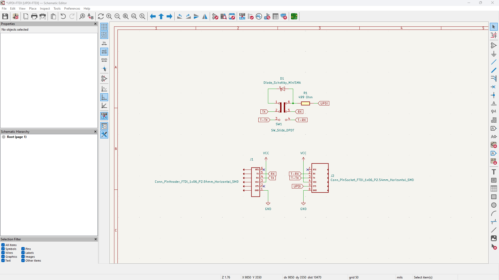

# ProshPlay_FTDI-UPDI_Switch
## Overview
 I made this breakout board to program the Avr 1 series chips like attiny1614, attiny412. This design have the feature to switch between the FTDI (UART) and UPDI Programming Mods with the help of a FTDI USB to TTL Serial Converter Adapter Module, Checkout the [ProshPlay_CH340G_Type-C_FTDI_Converter](https://github.com/saheenpalayi/ProshPlay_CH340G_Type-C_FTDI_Converter) that I used in this project 

## Schematic

## PCB

## Fabrication

## Testing

Refrences and Links

 - [Arduino Forum - Uploading Program to ATTiny 1616 via Serial UPDI and CH340 programmer](https://forum.arduino.cc/t/uploading-program-to-attiny-1616-via-serial-updi-and-ch340-programmer/1261787)